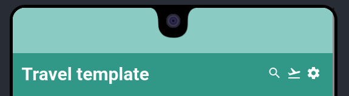
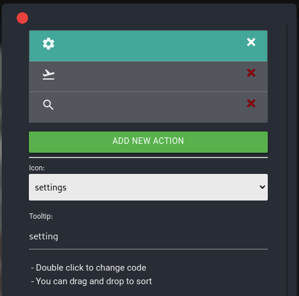

# appbar | نوار برنامه 

## توضیحات 
AppBar قسمت بالایی صفحه است، امکان در برگرفتن عنوان و برخی از دکمه و ها و منو را داراست و safeArea رنگ خود را با AppBar تطبیق می‌دهد

تصویر یک appbar در برنامه

## ویژگی‌ها 
-  [name](/fa/properties/name.md): نام کامپوننت
- [color](/fa/properties/color.md) : رنگ زمینه
- [textColor](/fa/properties/color.md) :رنگ متن
- back: دکمه بازگشت
- hide: پنهان ( این ویژگی در صورت فعال شدن المان ناپیدا می‌شود)
- menu : در مرحله آزمایشی، اکنون غیرقابل استفاده است
- actions: دکمه‌های appbar [توضیحات تکمیلی در ادامه]

## actions

با کلیک روی این گزینه آن را مدیریت کنید:
همانند تصویر می‌توانید دکمه‌ها را مدیریت کنید، اضافه یا حذف کنید آیکون و tooltip آن را تغییر دهید، و یا با Darg & Drop  می‌توانید ترتیب‌های آنها را تغییر دهید، و با دوبار کلیک کردن روی آنها رویداد هنگام کلیک شدن آن‌را تغییر دهید

