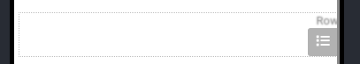

# row | سطر

## توضیحات

ستون‌ها به شما این امکان را میدهد المان ها کنار یکدیگر بچنید

## ویژگی‌ها

- [name](/fa/properties/name.md): نام
- [align](/fa/properties/align.md): جهت قرارگیری
- [padding](/fa/properties/padding.md): حاشیه از داخل
- [margin](/fa/properties/margin.md): حاشیه از خارج
- [height](/fa/properties/height.md) : ارتفاع
- [width](/fa/properties/width.md) : عرض
- [bgColor](/fa/properties/color.md) : رنگ زمینه
- [boderColor](/fa/properties/color.md) : رنگ خط حاشیه
- border - ضخامت قاب حاشیه
- axis - نحوه قرار گیری زیرمجموعه‌ها درکنار هم
- [borderRadius](fa/properties/borderRadius.md): گردی لبه ها
- hide: پنهان ( این ویژگی در صورت فعال شدن المان ناپیدا می‌شود)

## زیر مجموعه‌ها

برای تغییرات در فرزندان با کلیک روی نماد سمت راست زیر امکان پذیر است

و سپس می‌توانید با دیالوگ زیر فرزندان را حذف یا با Drag ترتیب را جا به جا کنید، و یا آنها را تکثیر کنید

