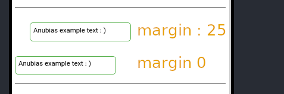

# margin

Margin just by pixel, percent is not available. The margin like css rules difference is that instead
space you must insert comma.

> You use 1,2,3 or 4 numbers for margin, sample: `20,25,45,75`
> 
>  When one value is specified, it applies the same margin to all four sides.
> 
> When two values are specified, the first margin applies to the top and bottom, the second to the left and right.
> 
> When three values are specified, the first margin applies to the top, the second to the right and left, the third to the bottom.
> 
> When four values are specified, the margins apply to the top, right, bottom, and left in that order (clockwise).

